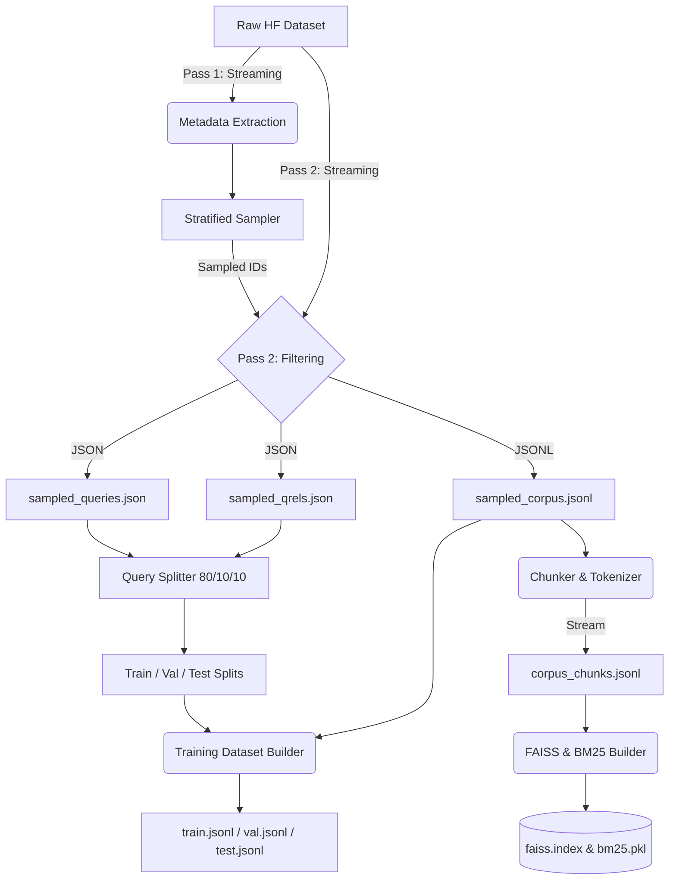

# DATA PIPELINE DESIGN

## 1. Kiến trúc hệ thống RAG

Hệ thống RAG (Retrieval-Augmented Generation) được thiết kế theo mô hình chuẩn cho Production, bao gồm:
1. **Data Ingestion & Preprocessing**: Streaming trực tiếp dữ liệu từ HuggingFace (hoặc file gốc) để làm sạch, phân mảnh (chunking) và mã hóa (tokenization).
2. **Indexing Strategy**: Xây dựng đồng thời hai loại Index:
   - **Sparse Index (BM25)**: Bắt từ khóa chính xác (Lexical Search).
   - **Dense Index (FAISS FlatIP)**: Tìm kiếm ngữ nghĩa (Semantic Search).
3. **Training Data Generation**: Tự động chuẩn bị tập dữ liệu huấn luyện cho Bi-Encoder (truy xuất) và Cross-Encoder (reranker) thông qua kỹ thuật hard/random negative mining.

---

## 2. Lý do chỉ dùng 50% data

Việc giới hạn `DATA USAGE CONSTRAINT` ở mức 50% (cả corpus và queries) nhằm đạt được 2 mục tiêu:
- **Tối ưu thời gian và chi phí huấn luyện**: Tập dữ liệu BEIR (`trec-news`) có kích thước tương đối lớn. 50% dữ liệu với phương pháp **Stratified Sampling** vẫn đảm bảo được tính đại diện (distribution representation) của không gian vector, mà lại giảm một nửa chi phí compute.
- **Phù hợp với giới hạn VRAM (4GB)**: Đảm bảo khả năng huấn luyện và infernce trên máy trạm thông thường mà không gặp nghẽn cổ chai I/O hay OOM (Out Of Memory).

---

## 3. Chiến lược chống OOM (Anti-OOM & Streaming Design)

Các lỗi cũ thường xuyên gặp phải bao gồm việc gọi `.extend()` để gom tất cả documents vào một Python list lớn (dẫn đến RAM explosion), hoặc việc khởi tạo ma trận NumPy khổng lồ cho FAISS trước khi `index.add()`. 

**Chiến lược khắc phục:**
- **2-Pass Data Loading**:
  - *Pass 1*: Tải toàn bộ metadata của dataset dưới dạng luồng (streaming). Chỉ lưu trong RAM `doc_id` và kích thước văn bản.
  - *Pass 2*: Dựa trên danh sách ID đã chọn (sampled IDs), tải và lưu trực tiếp xuống ổ cứng (`JSONL`). Không bao giờ đưa toàn bộ Text vào List bộ nhớ.
- **Streaming Chunker & Tokenizer**: Viết dưới dạng Generator (`yield`). Đọc file `.jsonl` từng dòng, xử lý thành chunks và ghi trực tiếp xuống file kết quả.
- **Batched FAISS Indexing**: Embeddings được sinh ra thông qua `SentenceTransformer` theo từng lô nhỏ (batch = 256), và đưa trực tiếp vào `faiss.IndexFlatIP` qua hàm `add()`. 

---

## 4. Chiến lược Data Splitting (Query-Level) & Tránh Leakage

- **Data Splitting**: Thực hiện chặt chẽ ở cấp độ truy vấn (**Query-level split**).
  - Train: 80% (Queries)
  - Validation: 10% (Queries)
  - Test: 10% (Queries)
- **Zero Leakage**: Vì toàn bộ `qrels` đi kèm chặt chẽ với query tương ứng, các queries dùng để test sẽ hoàn toàn không có ground-truth nào bị đưa vào phần train. `Corpus` (50% sampled) được giữ nguyên không chia split, và được dùng làm không gian chung cho Retrieval Index (BM25 và FAISS).

---

## 5. Các lỗi cũ và cách khắc phục

| Lỗi cũ (Previous Issues) | Phương pháp khắc phục (Resolution) |
| --- | --- |
| **Memory Explosion / OOM** | Thay thế `list.extend()` bằng `Generator` pattern và Streaming Write ra file `.jsonl`. |
| **GPU OOM khi encode FAISS** | Cơ chế Try-Catch tự động Fallback xuống CPU (với `batch_size // 4`) khi bộ nhớ GPU tràn. |
| **Tải nguyên BM25 tokenized corpus vào RAM** | Chấp nhận đánh đổi, sử dụng `word_tokenize_simple` thay vì Spacy/NLTK nặng nề. Vẫn giữ lại trong RAM list token để nạp vào `rank_bm25` vì `rank_bm25` chưa hỗ trợ streaming tốt, nhưng file text thô đã được dọn sạch khỏi bộ nhớ. |
| **Data Leakage khi chia tập ngẫu nhiên** | Phân tầng theo metadata của query thay vì document. Tách test/val hoàn toàn độc lập với train. |

---

## 6. Data Flow

